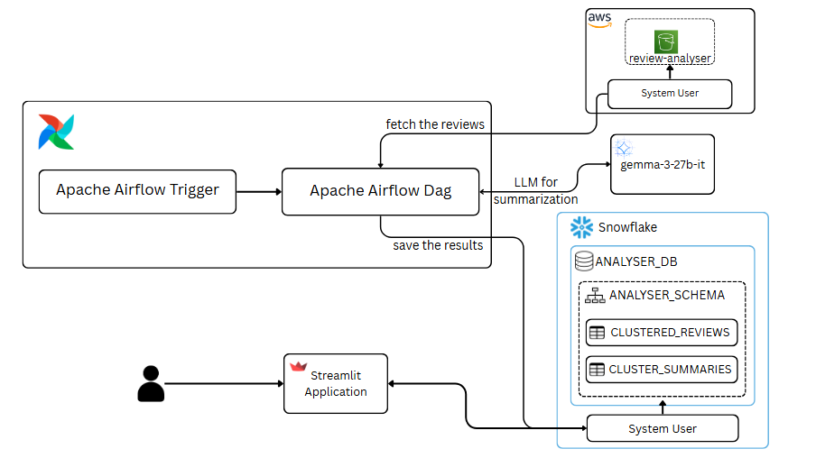
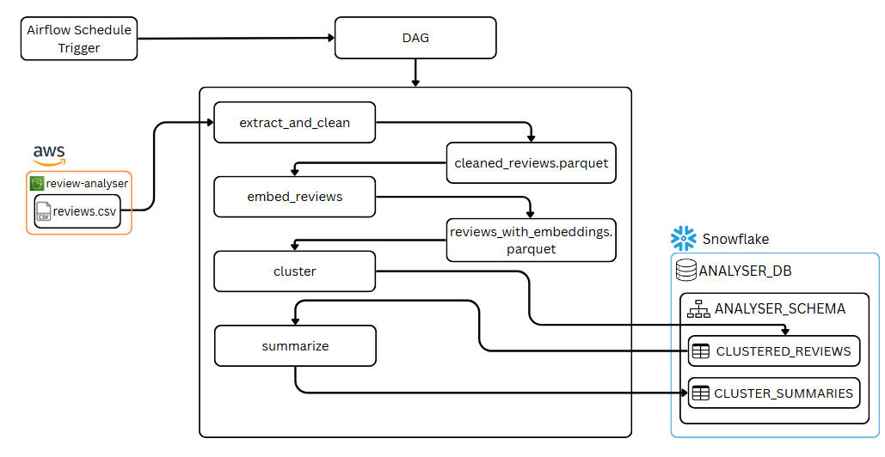

# Review Analyser 

The project delivers an end-to-end, reproducible data pipeline that ingests raw customer reviews and transforms them into structured, actionable insights. The pipeline is designed using [Apache Airflow](https://airflow.apache.org/) for workflow automation and scheduling that can be run daily to help the stakeholders quickly identify key customer sentiments, recurring themes, and emerging opportunities.

## Features

- Automated Daily Execution – Runs on a scheduled basis 
- Data Cleaning & Preprocessing - handles preparation of raw reviews for analysis.
- Review Clustering – Groups similar reviews into coherent, data-backed themes for easier interpretation.
- Sentiment Classification – Assigns positive, negative, or neutral sentiment to each theme and review.
- Volume Identification – Identifies the volume of reviews in a specific cluster/topic.
- Domain Identification – Highlights key product areas or experience domains referenced within the reviews.
- Interactive Dashboard – Provides a user-friendly interface for exploring themes, sentiments, and trends.

## Getting Started
This project consists of two main components:  

- **Airflow** – Used for orchestrating and scheduling the data processing pipeline.  
Note: The following setup for airflow is intended for Ubuntu/Linux environments. If you are on Windows, you should either:
    - Use WSL (Windows Subsystem for Linux) with Ubuntu installed, or

    - Run Airflow inside a Docker container.
- **Dashboard** – Built with Streamlit, located in the `airflow/dashboard` directory, for visualizing processed data and providing interactive analytics.  

### 1. **Airflow setup**

1. **Clone the repository:**
    ```bash
    git clone https://github.com/abhijith-das/review-analyser.git
    cd airflow
    git checkout review_dev
    ```

2. **Install dependencies:**
    ```bash
    pip install -r requirements.txt
    ```

3. **Initialize Airflow:**
    ```bash
    airflow db init
    ```

4. **Start Airflow scheduler:**
    ```bash
    airflow scheduler
    ```
5. **Start Airflow webserver:**
    ```bash
    airflow webserver -p 8080
    ```

5. **Access the Airflow UI:**  
    Visit [http://localhost:8080](http://localhost:8080)

### 2. **Dashboard Setup**

1. **Clone the repository:**
    ```bash
    git clone https://github.com/abhijith-das/review-analyser.git
    cd airflow
    git checkout review_dev
    ```

2. **Install dependencies:**
    ```bash
    pip install -r requirements.txt
    ```
   
3. **Navigate to dashboard files**
    ```bash
    cd dashboard
    ```

## Project Structure
An overview of the main directories and files in the project:

```
airflow/
├── dags/
│ └── review_pipeline.py
├── dashboard/
│ ├── utils/
│   ├── config.yaml
│   ├── data_config.yaml
│   ├── credentials.json
│   ├── snowflake_connector.py
│   └── db_operations.py
| └── main.py
├── Pipeline/
│ ├── stages/
│   ├── summarize.py
│   ├── extract_and_clean.py
│   ├── embed_reviews.py
│   ├── cluster.py
│ └── utils/
│   ├── config.yaml
│   ├── data_config.yaml
│   ├── credentials.json
│   ├── aws_connector.py
│   ├── snowflake_connector.py
│   └── db_operations.py
├── requirements.txt
├── .gitignore
└── README.md
```


## Architecture Diagram


## Data Flow Diagram


## Strategy for Picking Representative Quotes
A centroid-based method is employed to automatically choose sample quotes for every cluster. This method ensures that the chosen quotes accurately reflect the main themes of the cluster.
For each cluster:
- We identify the centroid, which is the central point of all reviews in that group.
- After that, we choose the three reviews that are most mathematically similar to this centroid. These evaluations are the best at summarising the cluster's common themes

## Strategy for Picking summaries in a cluster for LLM
When the dataset grows, it can get costly and time-consuming to send all of the reviews to LLM as token consumption rises. For each cluster, we use a two-part selection technique to give our language model a varied collection of reviews for summarisation:
- Top-Ranked Reviews: The 30 reviews that are mathematically closest to the centroid of the cluster are chosen. This guarantees the LLM has a solid base of reviews that accurately reflect the main idea.
- Random Noise: 20 additional random reviews from the same cluster are then added as random noise. Diversity and "noise," which are introduced in this way, aid the LLM in producing more reliable and broadly applicable summaries.

## Prompting strategy used
In order to reliably produce excellent summaries from a collection of reviews, our project use a structured prompt template.  By guaranteeing that each cluster receives the identical set of instructions, this method produces consistent and predictable outcomes.

To prevent the LLM from hallucinating and to ensure consistency, the prompt template is designed with several key components:

The prompt template is made with certain vital components to guarantee consistency and stop the LLM from having hallucinations:

Instructions: We give the LLM a set of precise, well-defined tasks to complete, such as coming up with a title and description that are strictly limited in word count.


Context: The prompt provides the LLM with the background knowledge they need, such as outlining the summary' objectives.

Input Data: The raw data required for processing by the LLM is provided in this section.

Output Indicator: To make it easier for our system to parse the response, the prompt specifies a strict output format

We significantly lower the likelihood of LLM hallucinations by combining these components with a zero-shot prompting strategy (because giving examples raises the likelihood of LLM hallucination for cluster reviews of different domain).  We can observe consistent outcomes by putting the previously mentioned strategies into practice.